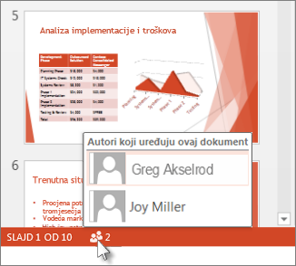

# Prezentacija o Microsoft PowerPointu
**Ivan Petešić**  
Studijski program: Stručni prijediplomski studij Informacijske tehnologije  
Predmet: Akademsko i tehničko pisanje  
Datum izrade: 26.11.2024.

---

# Uvod
**Microsoft PowerPoint** je najpopularniji alat za izradu prezentacija. Omogućuje korisnicima stvaranje dinamičnih, interaktivnih prezentacija s tekstom, slikama, animacijama, grafikonima i video sadržajem.

Zašto je PowerPoint važan za IT stručnjake?
- Koristi se za predstavljanje složenih podataka u jednostavnom formatu.
- Omogućuje izradu prezentacija za sastanke, predavanja i edukaciju.
- Integrira se s drugim Microsoftovim alatima, kao što su Word i Excel.

---

# Glavne značajke
## Ključne funkcionalnosti PowerPointa:
- **Animacije**: Omogućuju kretanje objekata ili teksta na slajdu.
- **Prijelazi**: Efekti prijelaza između slajdova.
- **Suradnja**: Mogućnost suradnje u stvarnom vremenu putem Office 365.
- **Slike i video**: Dodavanje multimedijalnih sadržaja za bolju vizualizaciju.

---

# Kako započeti rad u PowerPointu
1. Pokreni PowerPoint i odaberi "Nova prezentacija".
2. Dodaj slajdove koristeći predloške ili prazne slajdove.
3. Dodaj tekst, slike i multimedijalne sadržaje.
4. Primijeni animacije i prijelaze.

---

# Prednosti i nedostaci
## Prednosti:
- Intuitivno sučelje.
- Velik broj predložaka i dizajnerskih alata.
- Sposobnost dodavanja multimedije (video, slike, zvuk).

## Nedostaci:
- Povremene poteškoće u korištenju naprednih funkcija poput animacija.
- Ovisnost o Microsoftovim servisima za najbolje iskustvo (npr. Office 365).

---

# Suradnja u PowerPointu
PowerPoint omogućuje zajednički rad u stvarnom vremenu. Članovi tima mogu uređivati dokument putem **OneDrive** ili **Office 365**.

1. Pošaljite poveznicu na prezentaciju.
2. Pomoću "Komentari" opcije, suradnici mogu davati povratne informacije.
3. Sve promjene se automatski spremaju.

---

# Rad u timu s PowerPointom
PowerPoint omogućuje suradnju više korisnika u stvarnom vremenu, što je idealno za timske projekte.

- Dijelite prezentaciju s članovima tima.
- Koristite alat za komentare kako biste poboljšali prezentaciju.
- Sinkronizirajte promjene u stvarnom vremenu.

---

# Zaključak
Microsoft PowerPoint je nezaobilazan alat u profesionalnom i obrazovnom okruženju. Savršen je za stvaranje vizualno privlačnih prezentacija koje uključuju različite vrste medija i omogućuju suradnju u stvarnom vremenu.

**Osobni osvrt:**  
PowerPoint je alat koji omogućuje učinkovitu komunikaciju ideja, a učenje o njegovim funkcijama značajno poboljšava kvalitetu mojih prezentacija.

**Preporuka:**  
Preporučujem PowerPoint za sve IT stručnjake koji žele stvoriti profesionalne prezentacije.

---

# Reference
1. [Kako koristiti PowerPoint](https://edu.gcfglobal.org/en/powerpoint/)
2. [PowerPoint Tutorial - Video](https://www.youtube.com/watch?v=l5Ij7nUy9UQ)
